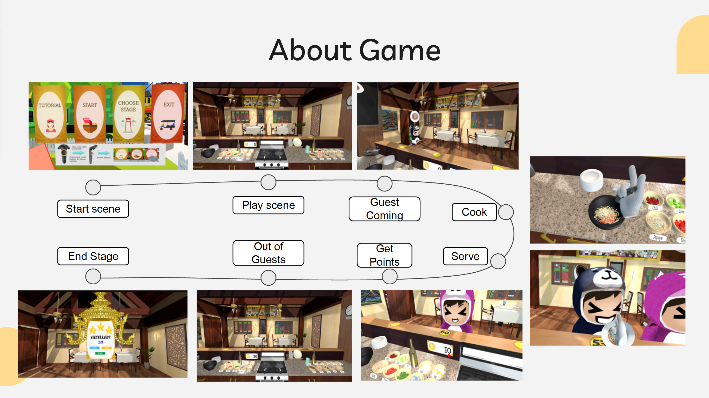

# CookingGameVR 

A Virtual Reality cooking game developed through the international collaboration between Kasetsart University and Dongseo University. Experience running a Thai restaurant in VR while mastering traditional Thai dishes.

## 🎮 Gameplay Videos

## 💻 System Requirements
- VR-Ready PC with:
  - Intel i7-8700 CPU or equivalent
  - 32GB RAM 
  - NVIDIA GeForce GTX 1060 or better
  - Windows OS
- HTC Vive VR Headset & Controllers
- SteamVR

## 🎯 Game Features
- Cook authentic Thai dishes:
  - Green Curry (แกงเขียวหวาน)
  - Pad Thai (ผัดไทย)
  - Som Tum (ส้มตำ)
- Progress through multiple challenging stages
- Serve cartoon-style customers in a charming restaurant setting
- Earn points and unlock new stages
- Master time management and cooking skills in VR
- Enemy system with thief characters
- Comprehensive tutorial mode

## 🎮 How to Play
1. Learn cooking techniques in Tutorial Mode
2. Progress through stages with increasing difficulty
3. Follow recipe instructions on the TV screen
4. Serve customers before they get impatient
5. Earn points based on customer satisfaction
6. Achieve stars to unlock new stages

## 🛠️ Tech Stack
- Unity Game Engine + SteamVR
- VRTK (Virtual Reality Toolkit)
- Maya (3D Modeling)
- Unity Asset Store (Character Models)
- Version Control: GitHub

## 📸 Game Preview
<table>
  <tr>
    <td></td>
  </tr>
  <tr>
    <td></td>
  </tr>
</table>

## 📋 Project Context
- **Development Period**: Aug - Dec 2019 (4 months internship program)
- **Location**: Dongseo University, South Korea
- **Academic Project**: Computer Science, Kasetsart University

*This project was developed as part of an international internship program between Kasetsart University and Dongseo University.*
