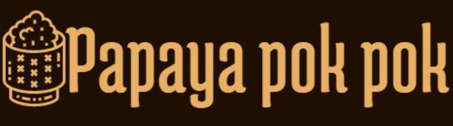

# CookingGameVR

A Virtual Reality cooking game developed through the international collaboration between Kasetsart University and Dongseo University. Experience running a Thai restaurant in VR while mastering traditional Thai dishes.

## 🎮 Gameplay Videos

## 🎯 Features
- Cook authentic Thai dishes (Green Curry, Pad Thai, Som Tum)
- Progress through multiple challenging stages
- Serve cartoon-style customers in a charming restaurant setting
- Earn points and unlock new stages
- Master time management and cooking skills in VR

## 🛠️ Tech Stack
- Unity Game Engine + SteamVR
- VRTK (Virtual Reality Toolkit)
- Maya (3D Modeling)
- Unity Asset Store (Character Models)
- Version Control: GitHub

## 📸 Game Preview
<table>
  <tr>
    <td></td>
  </tr>
  <tr>
    <td></td>
  </tr>
</table>

## 🎓 Project Context
- **Development Period**: 3+ months internship program
- **Location**: Dongseo University, South Korea
- **Academic Project**: Computer Science, Kasetsart University
- **Year**: 2019

## ⚡ Quick Links
- [Watch Game Trailer](https://www.youtube.com/watch?v=GLTwOGsafnc)
- [Watch Gameplay Demo](https://www.youtube.com/watch?v=tMMyDYpPr9g)

---
*This project was developed as part of an international internship program between Kasetsart University and Dongseo University.*
